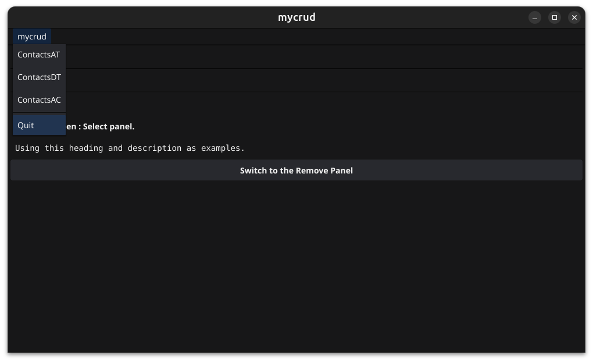

# kickfyne "fyne my way"

[The Fyne Toolkit](https://fyne.io/) is a favorite application tool kit of mine. After creating a couple of apps I decided to make my own little tool to build and manage building my fyne apps. So my tool is called kickfyne.

This is very much a work in progress. I started this years ago and then stopped while fyne made some critical changes. Now that those are made I'm starting where I left off.

## Summary July 8, 2025

kickfyne allows a developer to create a running framework and then

1. Add and remove screens to the GUI. Screens are layouts of panels. Currently there
   1. An AppTabs layout.
   1. A DocTabs layout.
   1. An Accordion layout.
   1. A simple layout.
1. Add and remove messages that the front-end and back-end will use to communicate.
1. Add and remove data stores and records.

## Example

### Create the framework.

The framework always works when modified with kickfyne.

```shell
＄ mkdir mycrud
＄ cd mycrud
＄ go mod init example.com/mycrud
＄ kickfyne framework
＄ go get fyne.io/fyne/v2/storage/repository@v2.6.1
＄ go mod tidy
＄ go build
＄ ./mycrud
```

### Hello world! The mycrud app's default opening screen

An app will open with it's default **Hello World** screen. The screen has 2 panels with over size buttons for switching back and forth. The **Hello World** screen is a simple screen. A simple screen has 1 or more panels and only displays one panel at a time.

The two panels are **Hello** and **HelloAgain**. 


### Add a simple screen to Edit a contact.

A simple screen layout has 1 or more panels but only displays one panel at a time.

The screen is named Edit and will have 2 panels, Select and Edit.
The Select panel is the default panel. In a real application, the Select panel would display a select list and the Edit panel would display the selected record in a form and allow the user to edit and save or cancel and go back to the select form.

```shell
＄ kickfyne screen add-simple Edit Select Edit
＄ go mod tidy
```

### Add a simple screen to Remove a contact.

Again, a simple screen layout has 1 or more panels but only displays one panel at a time.

The screen is named Remove and will have 2 panels, Select and Remove.
The Select panel is the default panel. In a real application, the Select panel would display a select list and the Remove panel would display the selected record and allow the user to remove or cancel and go back to the select form.

```shell
＄ kickfyne screen add-simple Remove Select Remove
＄ go mod tidy
```

### Add an AppTabs tabbar screen.

The AppTabs tabbar layout uses tabs that the user can not close.
The API allows you the developer, to open (add) and close (remove) tabs.

An AppTabs screen lays out an AppTabs tab bar.
The screen is named ContactsAT and the tabs are Add Edit and Remove.

In the command line
 * The tab name Add will gets it's content from it's own Add panel.
 * The tab name Edit is prefixed with *. So it's content comes from the Edit screen I previously made.
 * The tab name Remove is prefixed with *. So it's content comes from the Remove screen I previously made.

```shell
＄ kickfyne screen add-apptabs ContactsAT Add *Edit *Remove
＄ go mod tidy
```

### Add a DocTabs tabbar screen.

The DocTabs tabbar layout uses tabs that the user can close.
The API allows you the developer, to open (add) and close (remove) tabs.

A DocTabs screen lays out a DocTabs tab bar.
The screen is named ContactsDT and the tabs are Add Edit and Remove.

In the command line
 * The tab name Add will gets it's content from it's own Add panel.
 * The tab name Edit is prefixed with *. So it's content comes from the Edit screen I previously made.
 * The tab name Remove is prefixed with *. So it's content comes from the Remove screen I previously made.

```shell
＄ kickfyne screen add-doctabs ContactsDT Add *Edit *Remove
＄ go mod tidy
```

### Add an Accordion screen.

The Accordion uses labels listed vertically. Each label unfolds to present its content.
The API allows you the developer, to open (add) and close (remove) labels.

An Accordion screen lays out a vertical list of folded content labels.
The screen is named ContactsAC and the labels are Add Edit and Remove.

In the command line
 * The label name Add will gets it's content from it's own Add panel.
 * The label name Edit is prefixed with *. So it's content comes from the Edit screen I previously made.
 * The label name Remove is prefixed with *. So it's content comes from the Remove screen I previously made.

```shell
＄ kickfyne screen add-accordion ContactsAC Add *Edit *Remove
＄ go mod tidy
```

### Remove the default home screen and rewrite the app's main menu in the app's FyneApp.toml file.

```shell
＄ kickfyne screen remove HelloWorld
＄ go build
```

```toml
MainMenu = "ContactsAT ContactsDT ContactsAC"
```


```shell
＄ ./mycrud
```

### The ContactsAT screen

The **ContactsAT** screen is an AppTabs screen. The user can not close an AppTabs tab. The **ContactsAT** screen is shown below with its default panel **Add** displayed.


### The ContactsDT screen

The **ContactsDT** screen is an DocTabs screen. The **ContactsDT** screen is shown below with its **Edit** tab displayed. The **Edit** tab is using its own instance of the **Edit** screen for content. The **Edit** screen is displaying its default **Select** panel.


### The ContactsAC screen

The **ContactsAC** screen is an Accordion screen. The **ContactsAC** screen is shown below with its **Remove** label opened showing its content. The **Remove** label is using its own instance of the **Remove** screen for content. The **Remove** screen is displaying its default **Select** panel.


### The main menu

The main menu is at the top left of the app and it is shown open.


